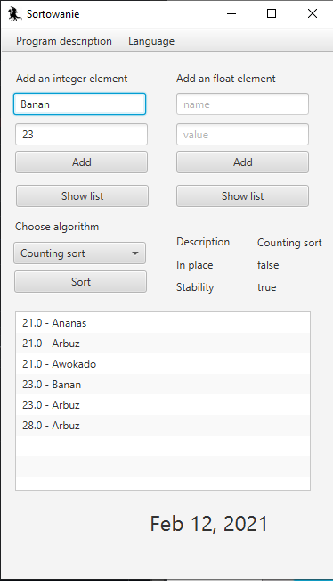
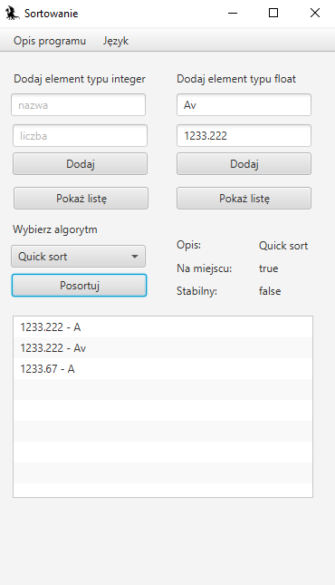

# JavaFX
Aplikacja wykorzystuje JavaFX oraz jar wykonany w repozytorium "Sortowanie_javadoc".  
Możliwości: 
- sortowanie liczb typu int lub float jednym z trzech rodzajów sortowania
- dodawanie liczb z etykietą do listy
- wyświetlanie informacji o algorytmie sortującym
- wyświetlenie informacji o programie
- zmiana języka programu na: polski, hiszpański i angielski
- wyświetlanie daty odpowiedniej dla wybranego kraju/języka

Przykład działania aplikacji w języku angielskim:  
  
Przykład działania aplikacji w języku polskim:  

